# MedLens

A medical image analysis and education platform with deep learning models, Grad-CAM visualization, and AI-powered explanations. Built with PyTorch, FastAPI, and React.

## Demo

🔗 **Live Demo**: [medlens-two.vercel.app](medlens-two.vercel.app)

## Overview

This project provides:
- REST API for medical image classification with Grad-CAM visualization
- AI-generated explanations using Claude vision API
- **Analyze Mode**: Upload images for diagnosis with visual + written explanations
- **Learn Mode**: Unlimited quiz for practicing diagnosis with instant feedback
- **Dashboard**: Track learning progress with accuracy charts and weak area identification
- Extensible architecture for adding new classification models

## Models

| Model | Task | Classes | Accuracy | AUC |
|-------|------|---------|----------|-----|
| `brain_tumor` | MRI Classification | Glioma, Meningioma, Pituitary, No Tumor | 99% | - |
| `pneumonia` | Chest X-Ray | Normal, Pneumonia | 88% | 0.958 |
| `bone_fracture` | X-Ray Fracture Detection | Fractured, Not Fractured | 98% | 0.998 |
| `retinal_oct` | Retinal OCT Analysis | CNV, DME, Drusen, Normal | 99% | - |

## Results

> 📊 **Click on any model below** to view training curves, confusion matrix, and Grad-CAM visualizations.

<details>
<summary><strong>🧠 Brain Tumor MRI Classification</strong> (99% accuracy)</summary>

### Brain Tumor MRI Classification

4-class classification of brain MRI scans.

| Metric | Value |
|--------|-------|
| Test Accuracy | 99% |
| Classes | Glioma, Meningioma, Pituitary, No Tumor |

**Training Progress**

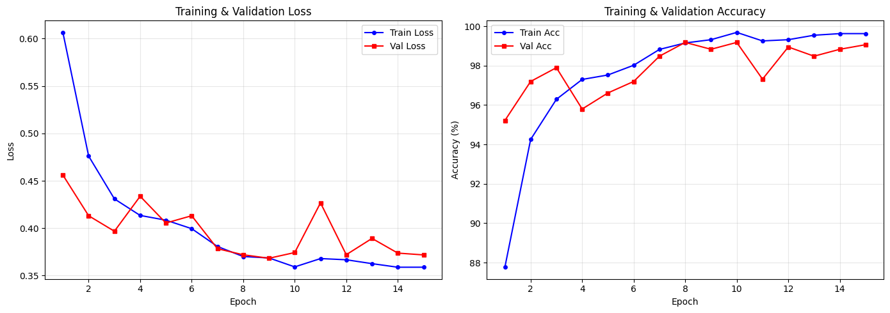

**Confusion Matrix**

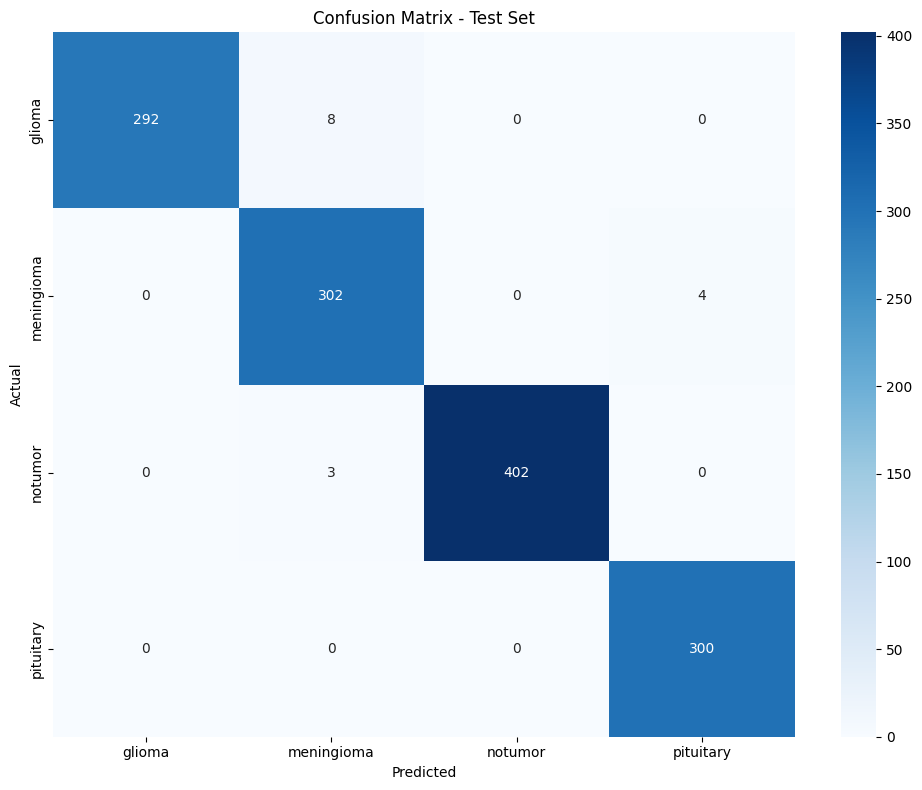

**Grad-CAM Visualizations**

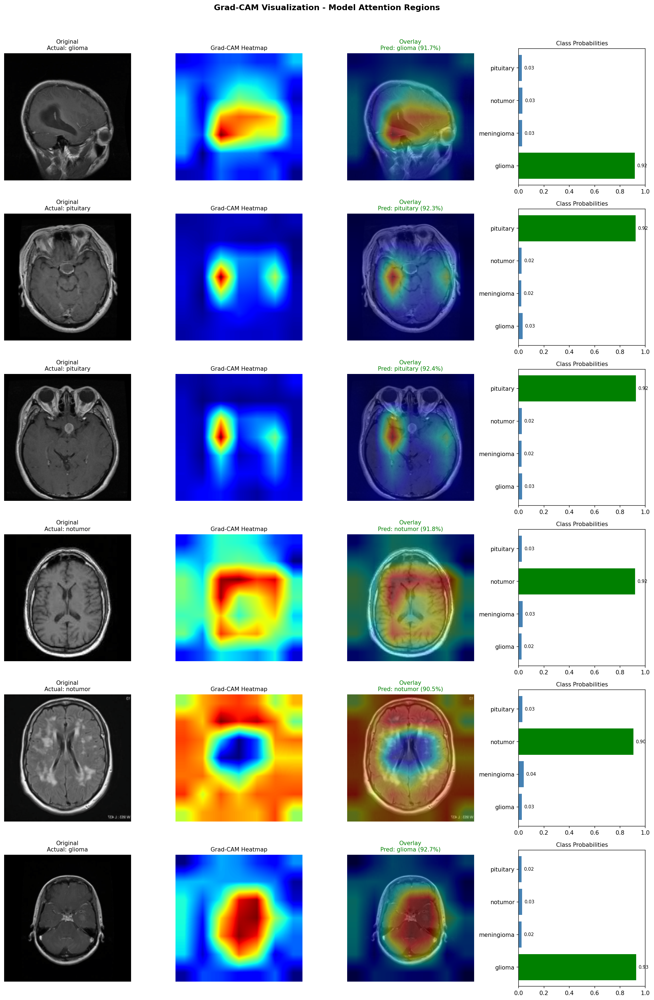

</details>

<details>
<summary><strong>🫁 Pneumonia Detection</strong> (88% accuracy, 0.958 AUC)</summary>

### Pneumonia Detection

Binary classification from chest X-rays.

| Metric | Value |
|--------|-------|
| Test Accuracy | 88% |
| AUC Score | 0.958 |
| Classes | Normal, Pneumonia |

**Training Progress**

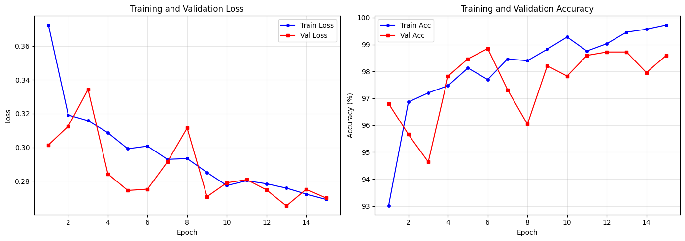

**Confusion Matrix**


**ROC Curve**


**Grad-CAM Visualizations**

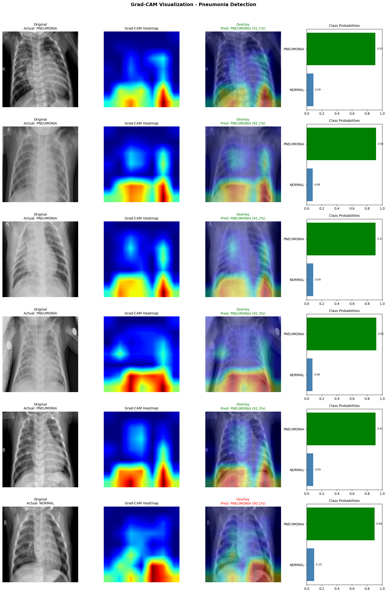

</details>

<details>
<summary><strong>🦴 Bone Fracture Detection</strong> (98% accuracy, 0.998 AUC)</summary>

### Bone Fracture Detection

Binary classification of X-rays across all anatomical regions.

| Metric | Value |
|--------|-------|
| Test Accuracy | 98.22% |
| AUC Score | 0.998 |
| Classes | Fractured, Not Fractured |

**Training Progress**

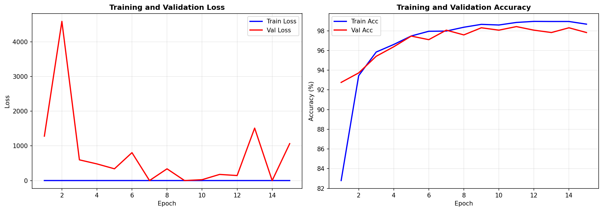

**Confusion Matrix**

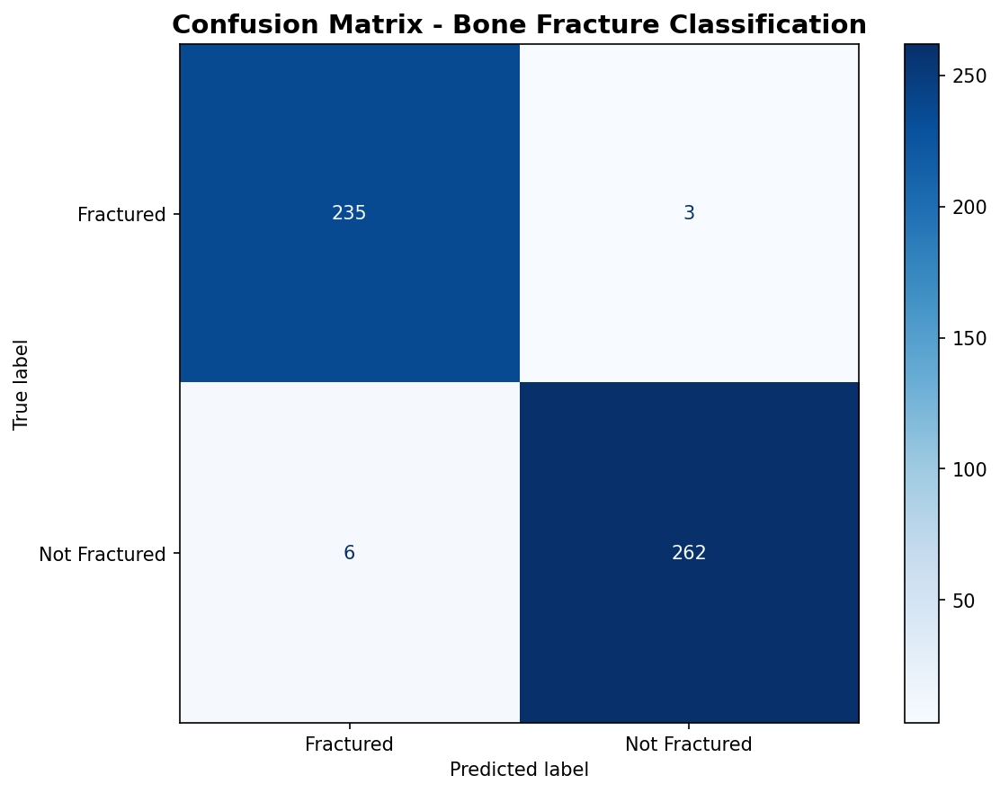

**ROC Curve**

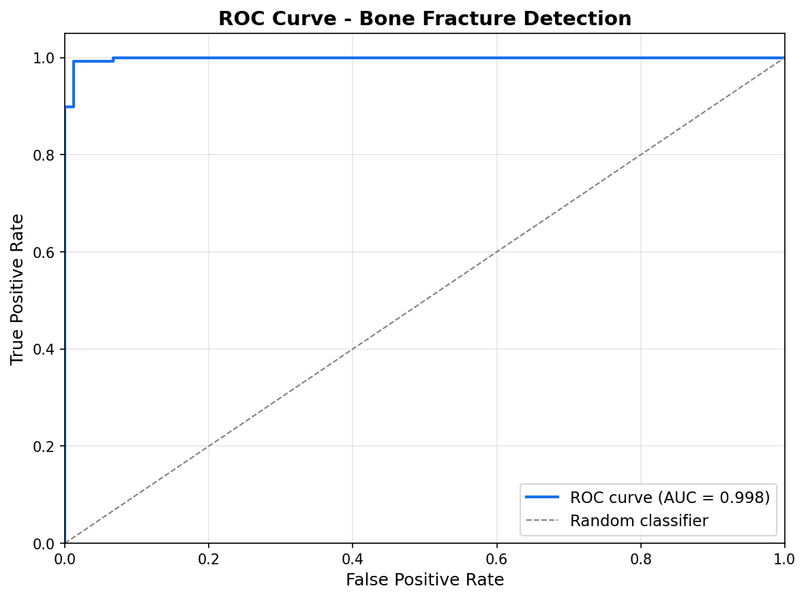

**Grad-CAM Visualizations**

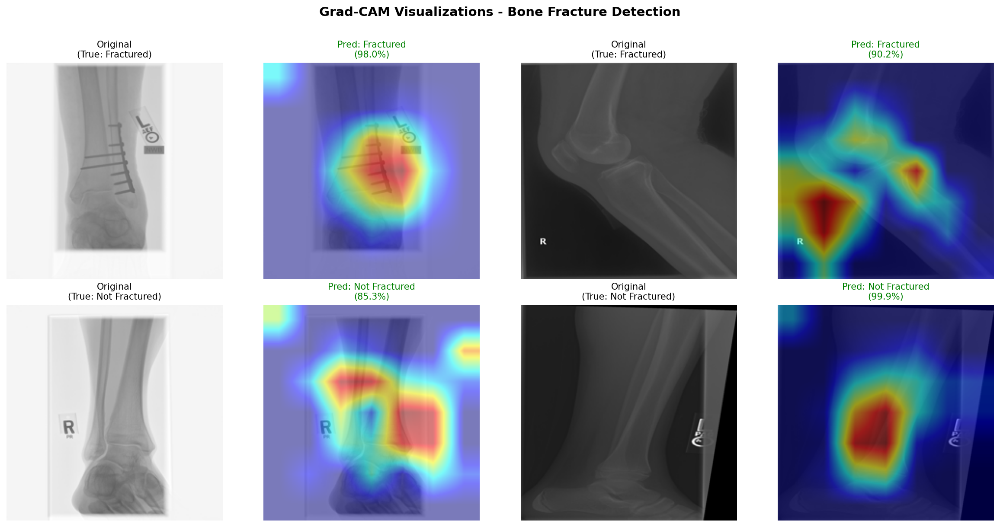

</details>

<details>
<summary><strong>👁️ Retinal OCT Analysis</strong> (99% accuracy)</summary>

### Retinal OCT Analysis

4-class classification of retinal OCT scans for eye disease detection.

| Metric | Value |
|--------|-------|
| Test Accuracy | 99.38% |
| Classes | CNV, DME, Drusen, Normal |

**Training Progress**

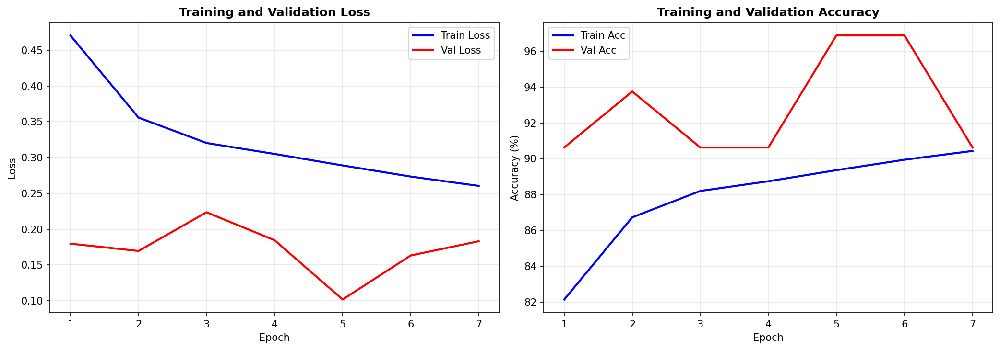

**Confusion Matrix**

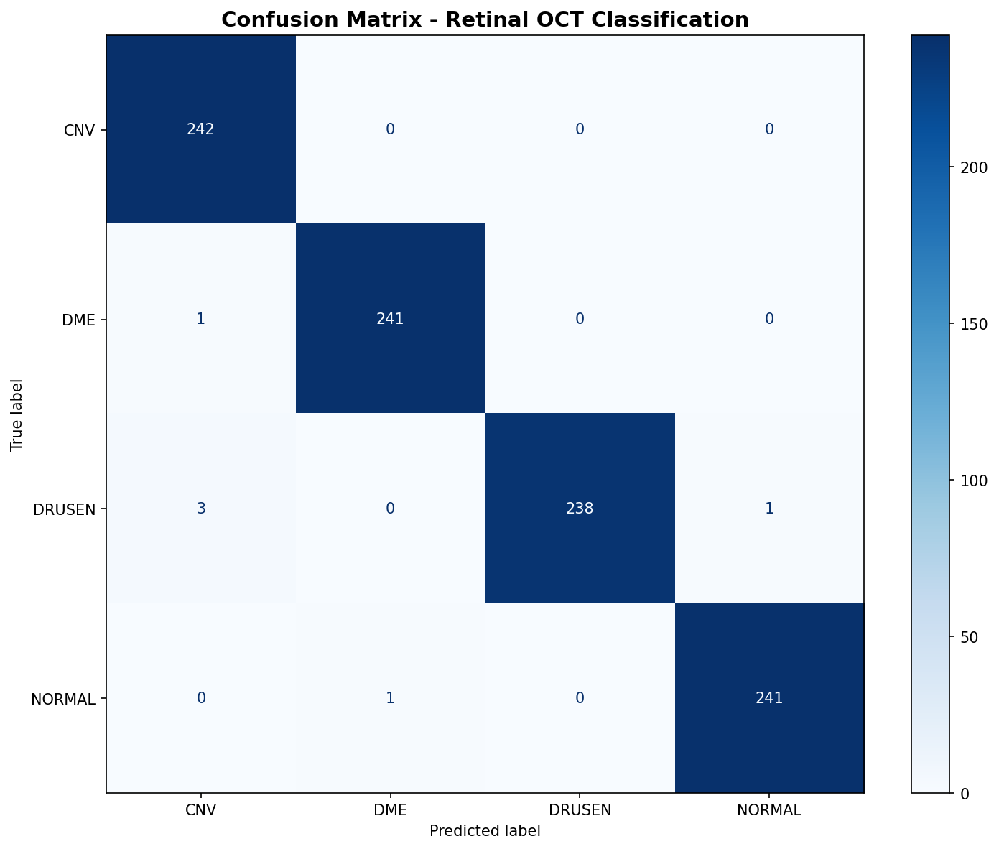

**Grad-CAM Visualizations**

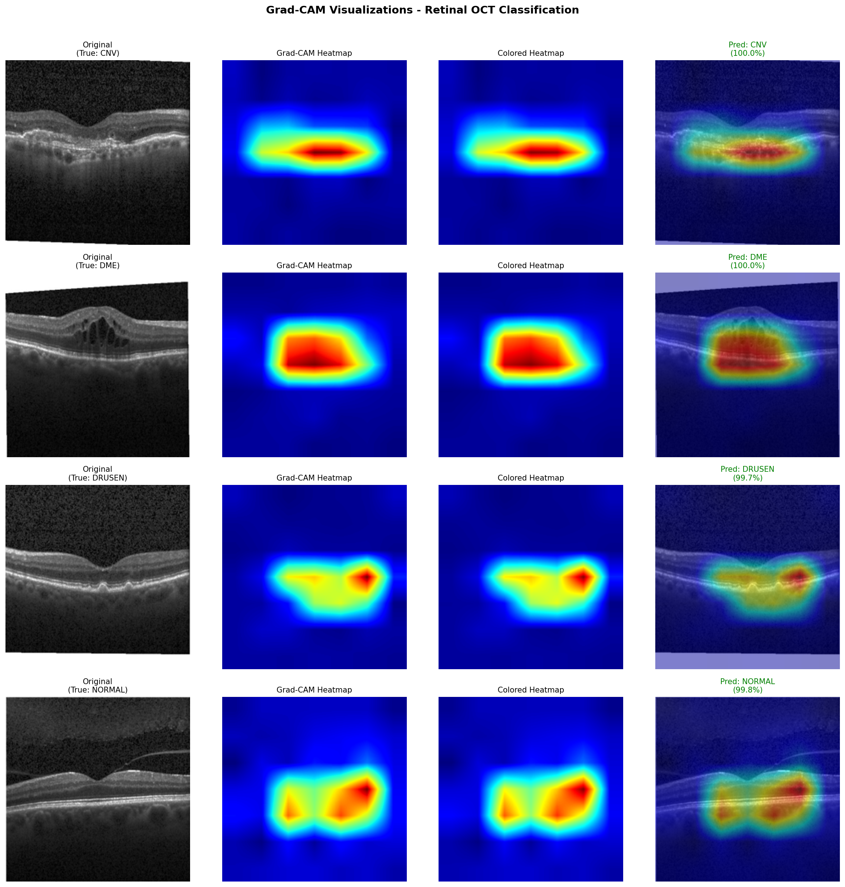

</details>

## Project Structure

```
medical-image-classifier/
├── api/
│   ├── app/
│   │   ├── main.py             # FastAPI application
│   │   ├── models/
│   │   │   ├── base.py         # Base classifier interface
│   │   │   ├── brain_tumor.py  # Brain tumor classifier
│   │   │   ├── pneumonia.py    # Pneumonia classifier
│   │   │   ├── bone_fracture.py # Bone fracture classifier
│   │   │   └── retinal_oct.py  # Retinal OCT classifier
│   │   └── utils/
│   │       ├── gradcam.py      # Grad-CAM visualization
│   │       └── llm.py          # Claude LLM integration
│   ├── scripts/
│   │   ├── generate_explanations.py  # Batch generate explanations
│   │   └── generate_overlays.py      # Batch generate Grad-CAM overlays
│   ├── weights/                # Model weights (not tracked in git)
│   ├── Dockerfile
│   ├── fly.toml
│   └── requirements.txt
├── frontend/
│   ├── src/
│   │   ├── pages/              # HomePage, AnalyzePage, LearnPage, DashboardPage
│   │   ├── components/         # React components
│   │   │   ├── shared/         # Navigation
│   │   │   └── quiz/           # Quiz components
│   │   ├── hooks/              # Custom hooks
│   │   └── utils/              # API, sample data, dashboard data
│   ├── public/
│   │   └── samples/            # Sample images and pre-cached overlays
│   ├── package.json
│   └── vite.config.js
├── notebooks/
│   ├── brain_tumor_classifier.ipynb
│   ├── pneumonia_classifier.ipynb
│   ├── bone_fracture_classifier.ipynb
│   └── retinal_oct_classifier.ipynb
└── assets/                     # README images
```

## Technical Details

### Model Architecture

All models use EfficientNet-V2-S pretrained on ImageNet with custom classification heads:
- Input: 224x224 RGB images
- Backbone: EfficientNet-V2-S (frozen early layers)
- Classifier: Dropout(0.3) → Linear(1280, 512) → ReLU → Dropout(0.15) → Linear(512, num_classes)

### Grad-CAM

Visualizations generated by backpropagating target class scores and computing weighted activation maps from the last convolutional layer.

### LLM Explanations

Image-specific explanations generated using Claude Haiku vision API, describing anatomical findings and Grad-CAM focus areas.

### Frontend Features

- **Analyze Mode**: Model selection, sample gallery, drag-and-drop upload, Grad-CAM visualization with opacity slider, AI explanations
- **Learn Mode**: Unlimited quiz, instant feedback with Grad-CAM, pre-cached explanations, session tracking
- **Dashboard**: Accuracy stats, per-model charts, weak area identification, session history
- Mobile responsive design

### Datasets

| Model | Dataset |
|-------|---------|
| Brain Tumor | [Brain Tumor MRI Dataset](https://www.kaggle.com/datasets/masoudnickparvar/brain-tumor-mri-dataset) |
| Pneumonia | [Chest X-Ray Pneumonia](https://www.kaggle.com/datasets/paultimothymooney/chest-xray-pneumonia) |
| Bone Fracture | [Fracture Multi-Region X-ray](https://www.kaggle.com/datasets/bmadushanirodrigo/fracture-multi-region-x-ray-data) |
| Retinal OCT | [Retinal OCT Images](https://www.kaggle.com/datasets/paultimothymooney/kermany2018) |

## API Reference

Full API documentation available at [medical-image-api.fly.dev/docs](https://medical-image-api.fly.dev/docs)

### Endpoints

| Method | Endpoint | Description |
|--------|----------|-------------|
| `GET` | `/health` | Health check |
| `GET` | `/models` | List available models |
| `POST` | `/predict/{model_name}` | Classification |
| `POST` | `/predict/{model_name}/gradcam` | Classification with Grad-CAM |
| `POST` | `/explain/{model_name}` | AI-generated explanation |

## Local Development

### API

```bash
cd api
python -m venv venv
source venv/bin/activate
pip install -r requirements.txt

# Add weights to weights/
# Add ANTHROPIC_API_KEY to .env

python -m uvicorn app.main:app --reload --port 8000
```

API docs: http://localhost:8000/docs

### Frontend

```bash
cd frontend
npm install

# Create .env.local for local development
echo "VITE_API_URL=http://localhost:8000" > .env.local

npm run dev
```

Frontend: http://localhost:5173

## License

MIT

## Acknowledgments

- [Brain Tumor MRI Dataset](https://www.kaggle.com/datasets/masoudnickparvar/brain-tumor-mri-dataset) by Masoud Nickparvar
- [Chest X-Ray Pneumonia Dataset](https://www.kaggle.com/datasets/paultimothymooney/chest-xray-pneumonia) by Paul Mooney
- [Bone Fracture Dataset](https://www.kaggle.com/datasets/bmadushanirodrigo/fracture-multi-region-x-ray-data) by B. Madushani Rodrigo
- [Retinal OCT Dataset](https://www.kaggle.com/datasets/paultimothymooney/kermany2018) by Kermany et al.
- [EfficientNet-V2](https://arxiv.org/abs/2104.00298) by Google Research
- [Grad-CAM](https://arxiv.org/abs/1610.02391) by Selvaraju et al.
